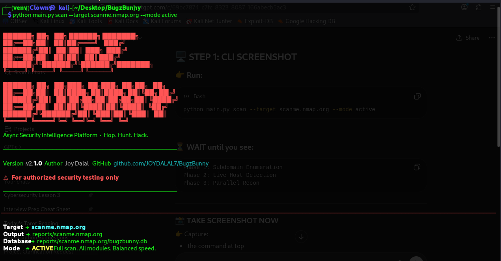
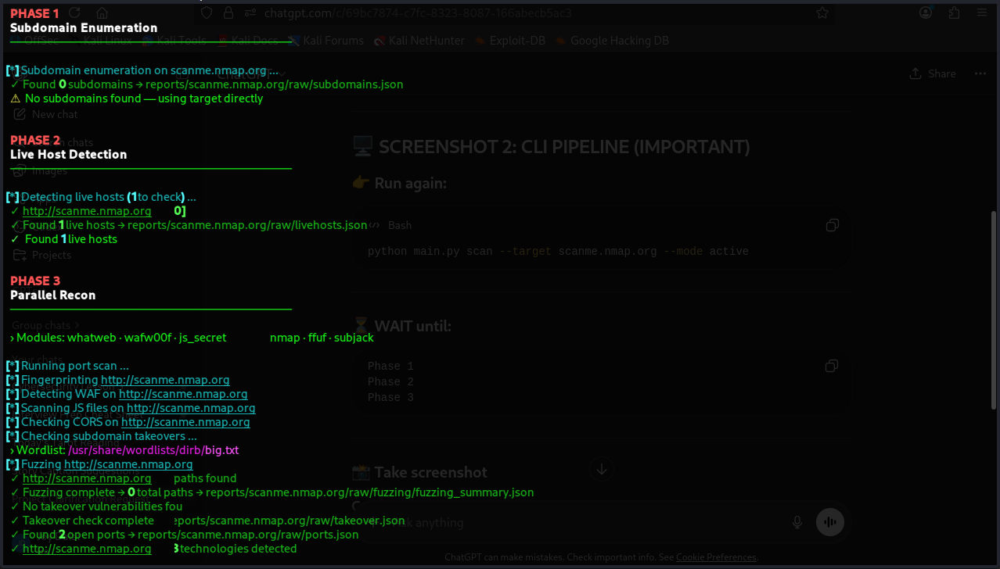
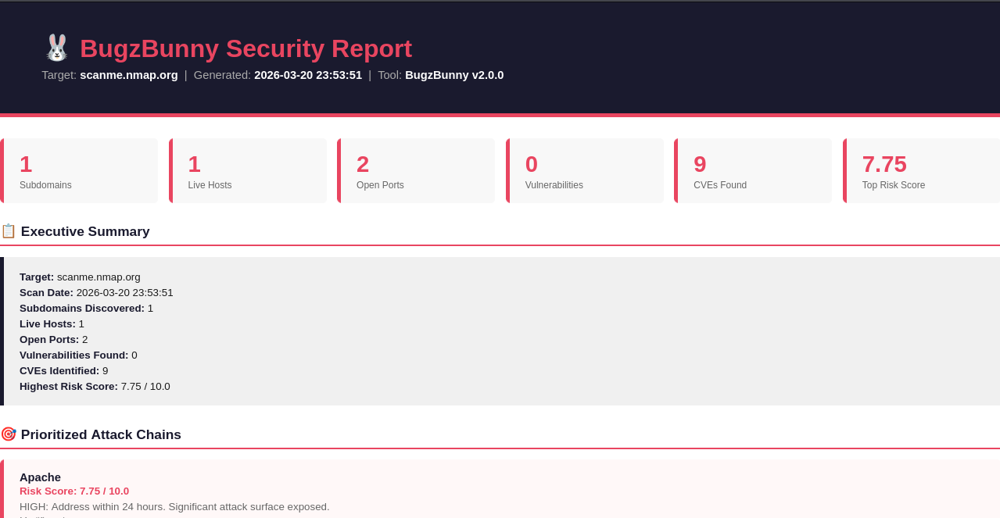
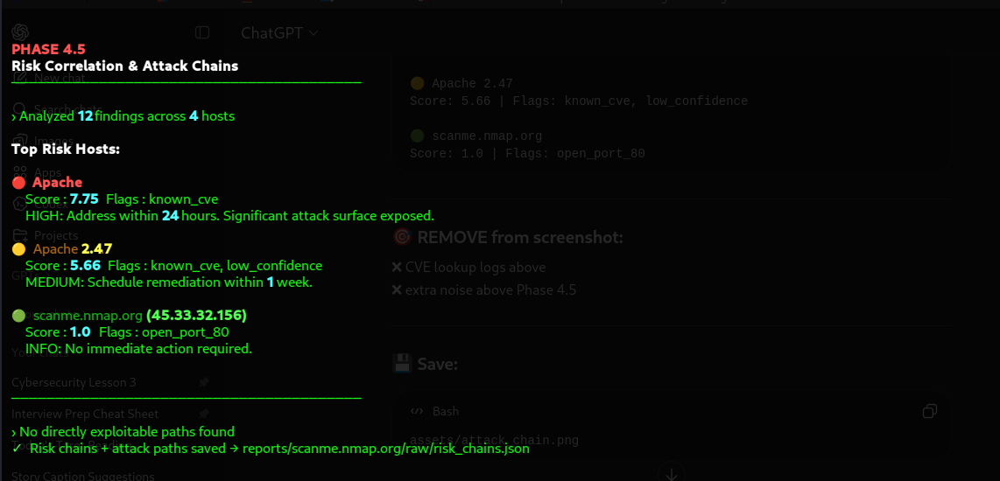
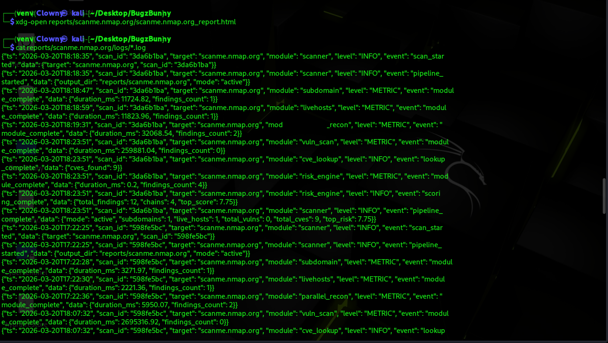

<div align="center">



# BugzBunny

[](https://python.org)
[](LICENSE)
[]()
[](https://docker.com)
[](https://fastapi.tiangolo.com)

**Async security intelligence platform that transforms raw scan data into prioritized, exploitable attack chains.**

[Installation](#installation) · [Usage](#usage) · [Features](#features) · [Intelligence Layer](#intelligence-layer) · [REST API](#rest-api)

</div>

---

## The Problem

Most recon tools give you a data dump:
```
port 443 open
nginx/1.18 detected
CVE-2021-44224 found
no WAF detected
```

You still have to figure out what it means.

## What BugzBunny Does
```
🔴  api.target.com  ·  Risk Score: 9.2  ·  EXPLOITABLE

    Chain   open_port:443 → tech:nginx/1.18 → cve:CVE-2021-44224 → no_waf
    Impact  Unprotected nginx host with known RCE vulnerability, no WAF protection
    Action  Immediate patching required — high probability of exploitation
```

BugzBunny correlates findings across 16+ modules, scores risk using a CVSS-inspired formula,
and surfaces exploitable attack paths — automatically.

---

## Screenshots

| CLI Execution | HTML Report |
|:---:|:---:|
|  |  |

| Attack Chains | Structured Logs |
|:---:|:---:|
|  |  |

---

## Features

| Module | Tool | Description |
|--------|------|-------------|
| 🔍 Subdomain Enumeration | `subfinder` | Passive + active discovery |
| 🌐 Live Host Detection | `curl` | HTTP/HTTPS probing |
| 🔌 Port Scanning | `nmap` | Open port and service detection |
| 📁 Directory Fuzzing | `ffuf` | Path brute-forcing |
| 🧬 Tech Fingerprinting | `whatweb` | Tech stack identification |
| 🛡️ WAF Detection | `wafw00f` | WAF presence and provider |
| 🎯 Subdomain Takeover | `subjack` | Dangling DNS detection |
| ⚠️ Vulnerability Scanning | `nuclei` | Template-based CVE detection |
| 🔎 CVE Lookup | `NVD API` | Service-to-CVE mapping |
| 🔐 JS Secret Detection | `custom` | Entropy-scored key extraction |
| 🌍 CORS Check | `custom` | Origin reflection + credential leaks |
| 🎲 Risk Engine | `custom` | Attack chain scoring |
| 📋 Structured Logging | `custom` | JSON telemetry per module |
| 📄 Reports | `jinja2 + weasyprint` | HTML + PDF output |
| 🌐 REST API | `FastAPI` | Programmatic scan control |
| 🐳 Docker | `docker-compose` | Containerized deployment |

---

## Intelligence Layer

### Risk Scoring Formula
```
base_score  = avg(severity_weight × confidence)
modifiers   = no_waf(+2.0) | known_cve(+2.5) | has_secret(+3.0)
              cors_creds(+3.5) | waf_present(-2.0) | low_confidence(-1.0)
final_score = clamp(base + modifiers, 0.0, 10.0)
```

### Exploitability Rule
```
exploitable = has_open_port
              AND (has_cve OR has_secret OR has_cors)
              AND no_waf
```

### JS Secret Detection Engine
```
pattern match → entropy check → false positive filter → confidence score

entropy < 2.0  →  rejected (placeholder value)
entropy > 4.0  →  confidence boosted
13 pattern types including AWS, GitHub, Stripe, JWT, private keys
```

### Structured Telemetry
```json
{
  "ts": "2026-03-20T12:01:38",
  "scan_id": "3b0d606f",
  "module": "parallel_recon",
  "level": "METRIC",
  "event": "module_complete",
  "data": { "duration_ms": 69953, "findings_count": 30 }
}
```

---

## Scan Modes

Every module adapts rate limits, templates, and coverage based on the selected mode.

| Module | `passive` | `stealth` | `active` | `aggressive` |
|--------|:---------:|:---------:|:--------:|:------------:|
| nmap | ❌ | `-T2` | `-T4 -F` | `-p- -sV` |
| ffuf | ❌ | ❌ | 50 threads | 100 threads |
| nuclei | ❌ | crit+high | all templates | all + CVEs |
| js_secrets | ❌ | critical | crit+high | all |
| cors | ❌ | 1 origin | 3 origins | 5 origins |
| subjack | ❌ | 5 threads | 20 threads | 50 threads |

---

## Pipeline
```
Phase 1    →  Subdomain Enumeration
Phase 2    →  Live Host Detection
           ┌──────────────────────────────────────────────────────┐
Phase 3    →  Port Scan · Fuzzing · Fingerprint · WAF             │  parallel
           │  Takeover · JS Secrets · CORS                        │
           └──────────────────────────────────────────────────────┘
           ┌──────────────────────────────────────────────────────┐
Phase 4    →  Nuclei Vulnerability Scan · CVE Lookup              │  parallel
           └──────────────────────────────────────────────────────┘
Phase 4.5  →  Risk Correlation + Attack Chain Engine
Phase 5    →  Database · Diff · HTML Report · PDF
```

---

## Installation

**Prerequisites**
```bash
sudo apt install subfinder nmap ffuf whatweb wafw00f subjack nuclei -y
nuclei -update-templates
```

**Local Setup**
```bash
git clone https://github.com/JOYDALAL7/BugzBunny.git
cd BugzBunny
python3 -m venv venv
source venv/bin/activate
pip install -r requirements.txt
```

**Docker**
```bash
docker-compose up -d
# API at http://localhost:8001/docs
```

---

## Usage
```bash
source venv/bin/activate

# Default active scan
python main.py scan --target hackerone.com

# Stealth mode
python main.py scan --target hackerone.com --mode stealth

# Custom output directory
python main.py scan --target hackerone.com --output /tmp/results

# Help
python main.py scan --help
```

---

## REST API
```bash
uvicorn api.main:app --host 0.0.0.0 --port 8000
```

| Method | Endpoint | Description |
|--------|----------|-------------|
| `POST` | `/scan` | Start a new scan |
| `GET` | `/scans` | List all scans |
| `GET` | `/scan/{id}` | Get scan status |
| `GET` | `/scan/{id}/report` | Retrieve HTML report |
| `DELETE` | `/scan/{id}` | Delete scan record |

Swagger UI available at `http://localhost:8000/docs`

---

## Output Structure
```
reports/target.com/
├── target.com_report.html      ← full HTML report with attack chains
├── target.com_report.pdf       ← professional A4 PDF
├── bugzbunny.db                ← normalized SQLite database (10 tables)
├── diff_report.json            ← delta from previous scan
├── logs/
│   └── <scan_id>.log           ← structured JSON telemetry
└── raw/
    ├── subdomains.json
    ├── ports.json
    ├── fingerprint.json
    ├── waf.json
    ├── vulnerabilities.json
    ├── cves.json
    ├── js_secrets.json
    ├── cors.json
    ├── risk_chains.json        ← attack chains + exploitable paths
    └── fuzzing/
```

---

## Database

10 normalized tables with foreign key relationships — fully queryable across modules.
```
Scan  ·  Finding  ·  Target  ·  Host  ·  Port
Technology  ·  WAFResult  ·  Secret  ·  CORSResult  ·  RiskChain
```

---

## Legal

> For **authorized security testing only.**
> Always obtain written permission before scanning any target.
> Only test systems you own or have explicit authorization to test.
> Only engage with targets listed on HackerOne, Bugcrowd, or Intigriti.

---

<div align="center">

Built by **Joy Dalal** — [@JOYDALAL7](https://github.com/JOYDALAL7)

*Hop. Hunt. Hack. 🐰*

</div>
